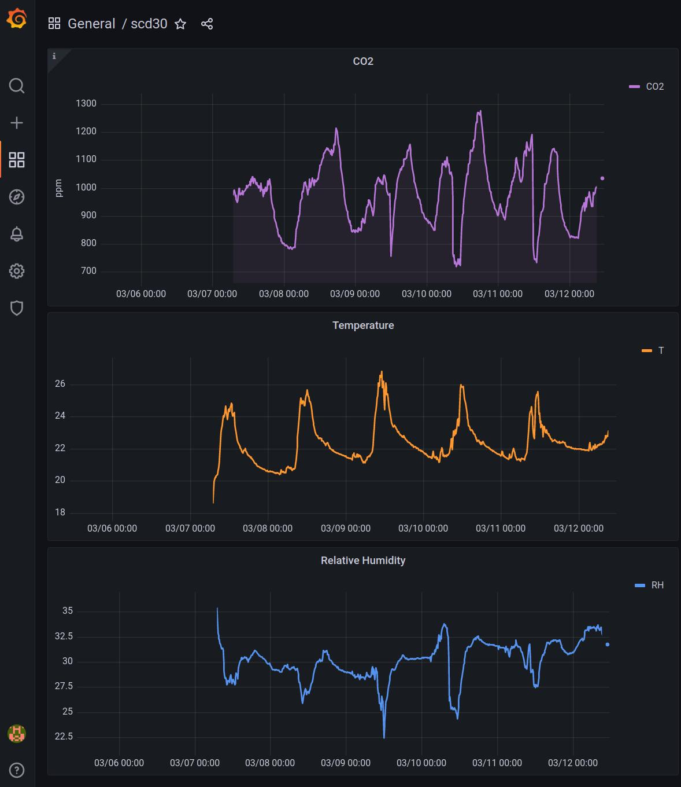

# History
I'll keep old versions of my_scd30.c under the name my_scd30_V<xx>.c to show how simple it can be.

# my_scd30_V00.c
A quick little 'C' program to check my [Sensirion SCD30](https://sensirion.com/products/catalog/SCD30/) is working (using modbus on a Raspberry Pi)

It has no dependency at all, it just uses Linux open/ioctl/read/write on a Raspberry's /dev/ttyS0 and the modbus messages are statically copied from the datasheet
[Sensirion_CO2_Sensors_SCD30_Interface_Description.pdf](https://sensirion.com/media/documents/D7CEEF4A/6165372F/Sensirion_CO2_Sensors_SCD30_Interface_Description.pdf)

```
$ gcc -o my_scd30 [my_scd30.c](https://github.com/xofc/my_scd30/blob/main/my_scd30.c)
$ ./my_scd30
test	439.1
CO2:	1022.7
T  :	21.4
RH :	30.7

CO2:	1023.2
T  :	21.3
RH :	30.6

CO2:	1023.8
T  :	21.4
RH :	30.6
...

```

# my_scd30_V01.c
Almost the same program after a little cleanup.  I still should verify the CRC and, maybe, provide a better 'read' mechanism.
For the moment, the program tries to read too many characters and times out after the device sent it what it has to send.
That is easy and cleanup the line in case it would receive some garbage.  The output has an
[influxdb](https://en.wikipedia.org/wiki/InfluxDB) format, making it easy to display the measurements in
[grafana](https://en.wikipedia.org/wiki/Grafana).  I should replace the 'tag/val' by 'crc_ok/1' or something.

```
$ ./my_scd30 
scd30,tag=val co2=963.6,t=23.1,rh=33.8 1647103638000000000
scd30,tag=val co2=962.4,t=23.1,rh=33.8 1647103648000000000
scd30,tag=val co2=962.0,t=23.1,rh=33.8 1647103659000000000
^C
$ nohup ./my_scd30 | curl -sS -i -XPOST 'http://localhost:8086/write?db=mydb' --data-binary @- --no-buffer --include &

$ influx -precision rfc3339
...
> use mydb
Using database mydb
> select * from scd30 limit 5;
name: scd30
time			co2	rh	t	tag
----			---	--	-	---
2022-03-07T06:09:00Z	975	35.4	18.6	val
2022-03-07T06:10:00Z	977.2	34.7	18.8	val
2022-03-07T06:11:00Z	975.5	34.5	19.1	val
2022-03-07T06:12:00Z	980.7	34.6	19.2	val
2022-03-07T06:13:00Z	986.7	34.4	19.3	val
```

In grafana, after setting the 'datasource' to the 'mydb' database on the local influxd (http://localhost:8086),
The queries are something like :
```
SELECT mean("co2") FROM "scd30" WHERE $timeFilter GROUP BY time($__interval) fill(null)
SELECT mean("t") FROM "scd30" WHERE $timeFilter GROUP BY time($__interval) fill(null)
SELECT mean("rh") FROM "scd30" WHERE $timeFilter GROUP BY time($__interval) fill(null)
```



# Remarks
I intended to use i2c but it needs 'clock stretching' and it does not seem to be that easy on a Raspberry Pi.  After attempting to use programs found on the Internet which have many dependencies and I was not able to use at all, I decided to use [modbus](https://en.wikipedia.org/wiki/Modbus) instead of [i2c](https://en.wikipedia.org/wiki/I%C2%B2C).  I first used [mbpoll(1)](https://manpages.ubuntu.com/manpages/impish/man1/mbpoll.1.html) ([git](https://github.com/epsilonrt/mbpoll.git)) and was able to get the expected firmware version (0x342) with
```
$ mbpoll -m RTU -a 0x61 -b 19200 -P none -t 4:hex -r 0x0021 -c 1 /dev/ttyS0 -v -1
...
[61][03][00][20][00][01][8C][60]
Waiting for a confirmation...
<61><03><02><03><42><B8><8D>
[33]: 	0x0342
...
```
But was not able to get the CO2 values (It should be possible but I don't know how).

# Raspberry Pi configuration
One has to use 'sudo [raspi-config](https://www.raspberrypi.com/documentation/computers/configuration.html)' to enable the serial link (but not the login process on it).  To be able to write on /dev/ttyS0 ([gpio pins](https://www.tutorialspoint.com/raspberry_pi/raspberry_pi_gpio_connector.htm) 8 & 10) as a normal user, it must be member of the 'dialout' group ($ sudo adduser $USER dialout).  A possibility to test the serial link is to use [minicom(1)](https://manpages.ubuntu.com/manpages/impish/man1/minicom.1.html) and to short-cut the Rx & Tx pins.  Setting up minicom is a little bit tricky as, by default, hardware handshaking seems to be enabled (it is not used on a Raspberry Pi).

# Modbus protocol
The address of the device is 0x61.  There are 2 types of sent messages : SET (0x06) et GET (0x03). Register address is on 2 bytes (MSB.LSB) and the register values are 2 bytes wide (MSB.LSB).  There is a 2 bytes CRC at the end.  All sent messages are 8 bytes long.  All the responses to the SET messages are 8 bytes long and the response to the GET is 7 bytes long except for the GET Mesures which is 17 bytes long (the 3d byte is the length of the response to the GET message).
```
SET   61 06 RR RR VV VV CC CC           --  61 06 RR RR VV VV CC CC                 RR.RR = register number - VV.VV = value
                                                                                    CC.CC = CRC
GET   61 03 RR RR 00 01 CC CC           --  61 03 02 VV VV CC CC                    01 = number of expected registers
                                                                                    02 = length of the response in bytes (except for measurements)
GET   61 03 00 28 00 06 CC CC               61 03 0C PP PP PP PP TT TT TT TT RH RH RH RH CC CC
                                                                                    PP.PP.PP.PP = CO2 ppm (float); TT... = temperature; RH...= humididy

START MEASUREMENT      61 06 00 36 pp pp CC CC    --  61 06 00 36 pp pp CC CC       pp.pp Atmospheric pressure in mBar (or 00.00)
STOP  MEASUREMENT      61 06 00 37 00 01 CC CC    --  61 06 00 37 00 01 CC CC
SET Dtime              61 06 00 25 SS SS CC CC    --  61 06 00 25 SS SS CC CC       SS.SS seconds between 2 measures
SET AutoCalibration    61 06 00 3A 00 AA CC CC    --  61 06 00 3A 00 AA CC CC       AA=01 autocalibration on -- AA=00 autocalibration off
SET ppm0               61 06 00 39 PP PP CC CC    --  61 06 00 39 PP PP CC CC       PP.PP = PPM0 (uint16)
SET Delta.temperature  61 06 00 3B TT TT CC CC    --  61 06 00 3B TT TT CC CC       TT.TT = delta temperature in 0.01 Kelvin (uint16)
SET Altitude           61 06 00 38 AA AA CC CC    --  61 06 00 38 AA AA CC CC       AA.AA = Altitude in meters (uint16)
Soft RESET             61 06 00 34 00 01 CC CC    --  

GET Dtime              61 03 00 25 00 01 CC CC    --  61 03 02 SS SS CC CC          SS.SS seconds between 2 measures
GET Ready Status       61 03 00 27 00 01 CC CC    --  61 03 02 00 xx CC CC          xx = 01 when ready
READ MEASURES          61 03 00 28 00 06 CC CC    --  61 03 0c PP PP PP PP TT TT TT TT HH HH HH HH CC CC      3 * 4 bytes (float value)
GET Autocalib          61 03 00 3A 00 01 CC CC    --  61 03 02 00 xx CC CC          xx 01/00 ON/OFF
GET ppm0               61 03 00 39 00 01 CC CC    --  61 03 02 PP PP CC CC          PP.PP  = PPM0
GET Delta.temperature  61 03 00 3B 00 01 CC CC    --  61 03 02 TT TT CC CC          TT.TT delta temerature in .01 K
GET Altitude           61 03 00 38 00 01 CC CC    --  61 03 02 AA AA CC CC          AA.AA altitude in meters
GET fw version         61 03 00 20 00 01 CC CC    --  61 03 02 03 42 CC CC          03.42 = actual firmware version
(to be verified)
```

# See also
* [https://github.com/sensirion/info](https://github.com/sensirion/info)
